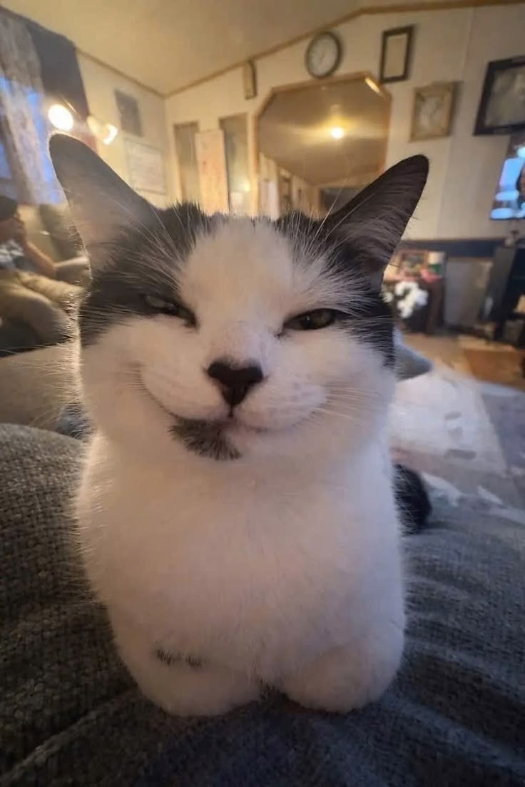
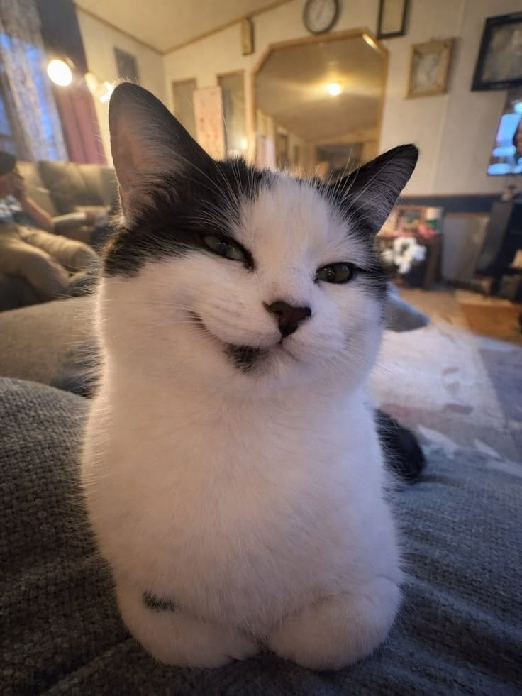
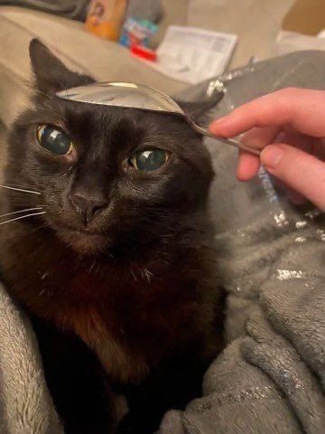

<div align="center">

<pre>
    _    _     _____ _  ______  
   / \  | |   | ____| |/ / ___| 
  / _ \ | |   |  _| | ' /\___ \ 
 / ___ \| |___| |___| . \ ___) |
/_/   \_\_____|_____|_|\_\____/ 
</pre>

# hey, i'm Aleks


<br>



<sub><i>this cat approves of your visit</i></sub>

<br>

**Computer Engineering student · Software Developer · Videographer**

<br>

[](https://github.com/alekslime)
[](https://www.linkedin.com/in/aleks-lime-896673329/)
[](#)

</div>

---

## a little about me

I'm a Computer Engineering student based in **Tirana, Albania**, interested in the parts of technology that sit close to the machine.

* Studying **Computer Engineering**
* Currently building **Resonant**, an accessible AI learning platform
* Learning more about **Linux, systems engineering, operating systems & hardware**
* Interested in **AI, software, embedded systems and developer tooling**
* Also work with **video production and editing**
* **1st place — GDG Tirana 2026** with Resonant-AI
* I like understanding **how things actually work**, not just making them work

> *Build it. Break it. Understand why it broke. Build it better.*

---

## currently building

### Resonant

**Your personal AI teacher that talks, reads, sees, and remembers.**

Resonant is an accessibility-focused learning platform designed to make studying possible through **voice, multimodal interaction, adaptive learning and accessible UX**.

The project is especially focused on students who are blind or visually impaired, while still being designed for **every student**.

**Currently working on:**

* Voice-first interaction
* Multimodal learning materials
* AI-powered explanations and tutoring
* Adaptive learning & progress
* Native Android experience
* Accessibility-first interaction
* Haptic navigation and feedback
* Exploring an Albania-based pilot

[](https://github.com/alekslime/Resonant-AI)

---

## toolbox

<div align="center">

### Languages


### Frameworks & development


### AI & local development


</div>

---

## other things i'm building

### Periphery OS

An Ubuntu-based Linux distribution for Computer Science and Computer Engineering students.

The goal is to make the operating system itself part of the learning experience:

* System-call tracing
* Memory & filesystem visualization
* Offline documentation
* Debugging tools
* Systems experimentation
* Deliberate practice
* AI assistants as **mentors**, not answer machines

---

### TinyHelper

A local, voice-first desktop copilot built around the idea that your assistant shouldn't need the cloud to be useful.

* Runs locally
* Voice-first
* Optional visual understanding
* Local LLMs
* No cloud AI APIs
* Designed for my own hardware

---

## GitHub

<div align="center">


<br>


</div>

---

## outside of code

When I'm not staring at a terminal:

* Video production & editing
* Camera work
* Playing games
* Listening to music
* Messing with hardware just to see what happens

### me

<div align="center">
<table>
  <tr>
    <td align="center"><br/><sub>hello</sub></td>
    <td align="center"><br/><sub>spoon hat</sub></td>
  </tr>
</table>
</div>

---

## currently

```text
learning       → Linux / systems / Android / software engineering
building       → Resonant
experimenting  → Periphery OS
exploring      → local AI + hardware
trying to fix  → everything I broke while learning the above
```

---

<div align="center">


<pre>
 /\_/\
( o.o )
 &gt; ^ &lt;
</pre>

### thanks for stopping by.

**I like to mess up and retry until I do it right**

</div>
